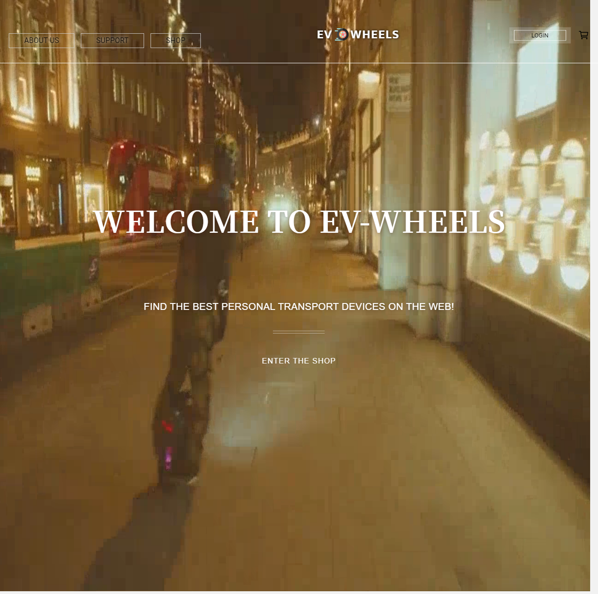
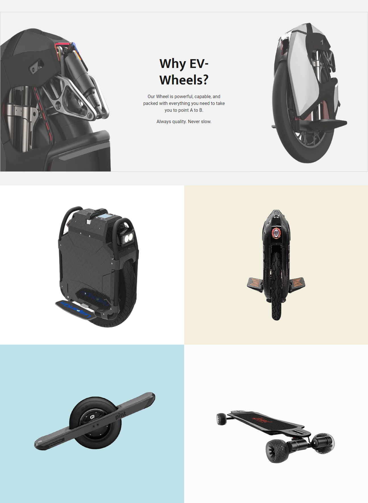

# EV-Wheels Store

> Store that sells PEV devices like EUC, E-bikes, and E-scooters

## Table of contents

- [General info](#general-info)
- [Project Demo](#project-demo)
- [Project Video](#project-video)
- [Technologies](#technologies)
- [Setup](#setup)
- [Features](#features)
- [Inspiration](#inspiration)
- [Contact](#contact)
- [License](#license)

## General info

EV-Wheels is an easy-to-use e-commerce store that allows shoppers to buy PEV devices. It contains all the e-commerce essentials for adding products and using PayPal and personal credit cards as payment systems.

<div align="center">EV-Wheels </div>
<br/>
<div align="center">
<kbd>

</kbd>
</div>

<br/>
<div align="center">
<kbd>

</kbd>
</div>

## Project Demo

[Click to view the site](https://ev-wheels.herokuapp.com/)

- Login

```
user: tom@gmail.com
pass: 123456
```

## Project Video

[Click to view the demo of EV-Wheels](./frontend/src/assets/demo.gif)

## Technologies

### Backend Development

- Node.js
- Express - version 4.17.1
- Express-async-handler - version 1.1.4
- Mongoose - version 5.10.0
- Bcryptjs - version 2.4.3
- Dotenv - version 8.2.0"
- Jsonwebtoken - version 8.5.1
- Mongoose - version 5.10.9
- Morgan - version 1.10.0
- Multer - version 1.4.2

### Frontend Development

- JavaScript (ES6)
- HTML5
- CSS3
- React.js - version 16.14.0
- React-DOM - version 16.14.0
- React-Router-DOM - version 5.2.0
- React-Scripts - version 3.4.4
- Redux - version 4.0.5
- Redux-thunk - version 2.3.0
- Axios - version 0.20.0
- React-bootstrap - version 1.3.0
- React-helmet - version 6.1.0

## Setup: To try out this project:

##### Client

1. Clone the GitHub repository locally to your computer
1. In the command line, navigate to the root directory of the repository, and type the following:
   $ npm install
1. Navigate to the client folder, and in the root directory of the client folder, type the following:
   $ npm install
1. In the client folder, and in the root directory of the client folder, type the following:
   $ npm start

##### Server

1. Navigate to the client folder, and in the root directory of the client folder, type the following:
   $ npm install
1. Create a `.env` files for server
1. Create a MongoDB account and get the URL
1. Add MongoDB URL in the env file

```
MONGO_URL=your-key-here
```

5. Create a PayPal account and get the id

```
PAYPAL_CLIENT_ID=your-id-here
```

6. `npm dev` to start the client and server together
7. Visit `localhost:3000`

## Code Examples

### Node.js/Express.js

```Node
app.get('/api/config/paypal', (req, res) =>
  res.send(process.env.PAYPAL_CLIENT_ID)
)

const __dirname = path.resolve()
app.use('/uploads', express.static(path.join(__dirname, '/uploads')))
//check if production
if (process.env.NODE_ENV === 'production') {
  app.use(express.static(path.join(__dirname, '/frontend/build')))
  app.get('*', (req, res) =>
    res.sendFile(path.resolve(__dirname, 'frontend', 'build', 'index.html'))
  )
} else {
  app.get('/', (req, res) => {
    res.send('API is Running...')
  })
}

//check error
app.use(notFound)
app.use(errorHandler)

const PORT = process.env.PORT || 5000

app.listen(
  PORT,
  console.log(`Server running in ${process.env.NODE_ENV} on port ${PORT}`)
)
```

### JavaScript/React.js

```jsx
useEffect(() => {
  dispatch(listProducts(keyword, pageNumber));
}, [dispatch, keyword, pageNumber]);

return (
  <div className='store-container'>
    <SearchBox history={history} />
    {/* {!keyword ? (
        <ProductCarousel />
      ) : (
        <Link to='/' className='btn btn-light'>
          Go Back
        </Link>
      )} */}
    <h1>Latest Products</h1>
    {loading ? (
      <Loader />
    ) : error ? (
      <Message variant='danger'>{error}</Message>
    ) : (
      <>
        <Row>
          {products.map((product) => (
            <Col key={product._id} sm={12} md={6} lg={4} xl={3}>
              <Product product={product} />
            </Col>
          ))}
        </Row>
        <Paginate pages={pages} page={page} keyword={keyword ? keyword : ''} />
      </>
    )}
  </div>
);
```

## Features

- Full-stack web application utilizing the MERN stack: MongoDB, Express.js, React, and Node.js.
- Authorization and authentication implemented with JWT and bcrypt.
- Front-End styles and shop components built with CSS and Bootstrap.
- Users can create an account through the application.
- Users can add profile information, payment information, shop, and checkout.
- Add PEV devices and update them as they get processed
- Admin accounts can add and delete products, handle shipment, and drop and edit user accounts.

## Status

The project is: finished with the option to expand functionality and DRY out code.

## Inspiration

The inspiration for EV-Wheels came as I was riding my e-bike. With the increase of PEV devices currently available in the market. I decided to create a store to sell all my favorite devices and allow users easily shop for PEV in one location.

## Contact

Created by [Van Vy](vanby.com)
Feel free to contact me with any questions!

## License

[](https://www.gnu.org/licenses/gpl-3.0)
